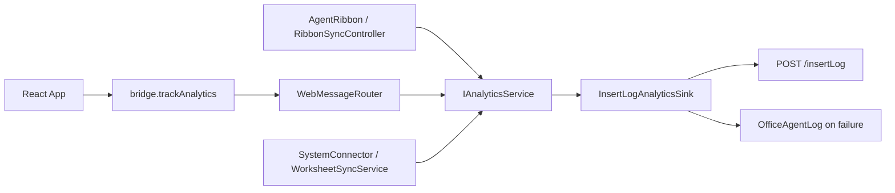

# OfficeAgent Analytics Instrumentation Design

日期：2026-05-12

状态：待评审

## 1. 背景与目标

当前 OfficeAgent / Resy AI 已经有诊断日志 `OfficeAgentLog`，覆盖启动、WebView2、bridge、SSO、Ribbon Sync 和部分业务 API 异常。诊断日志面向排障，不适合作为运营分析的数据契约。本设计新增一套独立 analytics 埋点通道，用于自动覆盖主要用户交互，并允许 SystemConnector 在业务逻辑中扩展事件上下文。

第一版目标：

- 覆盖 Excel Ribbon 用户交互，包括任务窗格开关、登录、项目下拉、初始化、AI 映射列、配置、下载、上传、文档和关于。
- 覆盖 Task Pane / React panel 用户交互，包括按钮点击、发送、确认、取消、设置保存、会话切换等前端动作。
- 允许 C# 业务流程和 `ISystemConnector` 实现自由附加结构化业务信息。
- 通过 HTTP POST 上报到内网接口兼容的 `/insertLog`。
- 提供本地 mock server 模拟 `/insertLog`，用于开发和集成测试。
- 埋点失败不能阻塞用户操作，也不能改变 Ribbon Sync、task pane 或 connector 的业务行为。

非目标：

- 第一版不做离线持久队列、补发、批量压缩或 exactly-once 语义。
- 第一版不引入第三方 analytics SDK。
- 第一版不采集用户输入正文、单元格原始业务值或整行数据快照。
- 第一版不把 `OfficeAgentLog` 改造成业务埋点通道。

## 2. 上报接口

内网系统最终接口：

```http
POST https://{HOST}/insertLog
Content-Type: application/json
```

请求体：

```json
{
  "frontEndIntent": "excelAi",
  "clientSource": "Excel",
  "questionType": 1,
  "askId": "zzZMg0D112lo12uFFJOJRuiOsf9NfYsG",
  "talkId": "wyyv2PswaGNyYGJnkBodXgd1daG6Rzxc",
  "answer": "{\"schemaVersion\":1,\"eventName\":\"ribbon.download.clicked\"}"
}
```

固定字段：

- `frontEndIntent = "excelAi"`
- `clientSource = "Excel"`
- `questionType = 1`

动态字段：

- `askId`：每条上报随机生成，32 位左右 URL-safe 字符串。
- `talkId`：每条上报随机生成，32 位左右 URL-safe 字符串。第一版不要求与 chat session 绑定，后续可接入真实会话 ID。
- `answer`：analytics 事件 JSON 的字符串形式。

成功响应兼容策略：

- HTTP 2xx 视为成功。
- 非 2xx、超时、网络异常视为失败，写入 `OfficeAgentLog.Warn/Error`，不向用户弹窗。

## 3. Analytics 事件模型

`answer` 字段承载的 JSON 结构：

```json
{
  "schemaVersion": 1,
  "eventName": "ribbon.download.clicked",
  "source": "ribbon",
  "occurredAtUtc": "2026-05-12T10:00:00.0000000Z",
  "properties": {
    "systemKey": "current-business-system",
    "projectId": "performance",
    "projectName": "绩效项目",
    "sheetName": "Sheet1",
    "operation": "partialDownload",
    "result": "started"
  },
  "businessContext": {
    "module": "progress",
    "planType": "monthly"
  },
  "error": {
    "code": "authentication_required",
    "message": "Authentication required."
  }
}
```

字段说明：

- `schemaVersion`：整数，第一版固定 `1`。
- `eventName`：稳定事件名，使用 `domain.action.phase` 风格，例如 `ribbon.upload.confirmed`。
- `source`：事件来源，第一版允许 `ribbon`、`panel`、`bridge`、`connector`、`business`、`host`。
- `occurredAtUtc`：事件生成时间，UTC ISO-8601。
- `properties`：通用运营维度，字段应稳定、低敏、便于筛选聚合。
- `businessContext`：业务系统或 connector 自由扩展的 JSON 对象，不要求跨系统统一字段。
- `error`：失败信息，单独存放，避免混入 `properties` 或 `businessContext`。

`properties` 推荐字段：

- `systemKey`
- `projectId`
- `projectName`
- `sheetName`
- `workbookName`
- `operation`
- `result`
- `durationMs`
- `uiLocale`
- `commandType`
- `bridgeType`
- `sessionId`
- `confirmationKind`

`businessContext` 适用场景：

- SystemConnector 需要记录内网系统的模块、流程、对象类型、业务状态码。
- Ribbon Sync 某些业务系统有特定概念，例如计划类型、阶段、活动类型。
- 后续接入多个业务系统时，各系统字段不一致，避免污染通用 `properties`。

敏感信息规则：

- 不记录 API key、cookie、SSO URL 中的 token。
- 不记录用户输入 prompt 全文，只记录长度、是否命中命令、命令类型。
- 不记录单元格原始值、整行业务数据或上传 payload 原文。
- `businessContext` 默认也遵守同样规则。需要业务字段白名单时，由具体 connector 显式构造。

## 4. 架构

新增独立 analytics 通道，不复用 `OfficeAgentLog` 的 API。



### 4.1 Core

新增模型与接口，放在 `src/OfficeAgent.Core/Analytics`：

- `AnalyticsEvent`
  - 事件名、来源、时间、properties、businessContext、error。
- `AnalyticsError`
  - code、message、exceptionType。
- `IAnalyticsService`
  - `void Track(AnalyticsEvent analyticsEvent)`
  - `void Track(string eventName, string source, IDictionary<string, object> properties = null, IDictionary<string, object> businessContext = null, AnalyticsError error = null)`
- `IAnalyticsSink`
  - `Task WriteAsync(AnalyticsEvent analyticsEvent, CancellationToken cancellationToken)`
- `AnalyticsService`
  - 补齐时间、schemaVersion。
  - 调用 sink。
  - 捕获 sink 异常并写诊断日志。
  - 对外不抛异常。
- `NoopAnalyticsService`
  - analytics 未配置或测试不需要时使用。

### 4.2 Infrastructure

新增 `InsertLogAnalyticsSink`，放在 `src/OfficeAgent.Infrastructure/Analytics`：

- 读取 analytics endpoint 配置。
- 将 `AnalyticsEvent` 序列化成 JSON 字符串，写入外层 `answer`。
- 生成 `askId` 和 `talkId`。
- POST 到 `{analyticsBaseUrl}/insertLog`。
- 复用项目现有 JSON 库和 HTTP 风格，避免引入新依赖。

配置建议：

- 第一版在 `AppSettings` 中新增 `Analytics Base URL`，允许为空。
- 为空时使用 `NoopAnalyticsService` 或 disabled sink。
- 本地联调时设置为 `http://localhost:3200`。
- 最终内网部署时设置为 `https://{HOST}`。

说明：虽然业务接口也有 `Business Base URL`，analytics base URL 独立配置更清晰，避免业务 API 和运营分析接口部署在不同域名时被迫耦合。若用户明确希望复用，也可以在 UI 中提供“留空则回退到 Business Base URL”的兼容规则。

### 4.3 ExcelAddIn

`ThisAddIn` 启动时组装 analytics：

- 从 `SettingsStore.Load()` 获取 analytics 配置。
- 创建 `InsertLogAnalyticsSink` 或 `NoopAnalyticsService`。
- 将 `IAnalyticsService` 传给：
  - `AgentRibbon` / `RibbonSyncController` / `RibbonTemplateController`
  - `WebMessageRouter`
  - `WorksheetSyncService` 或 `WorksheetSyncExecutionService`
  - 需要自由扩展的 connector

测试和现有构造器可通过默认参数保留兼容：

- 未显式传入时使用 `NoopAnalyticsService.Instance`。
- 避免一次性修改大量测试构造代码。

## 5. Ribbon 埋点设计

Ribbon 事件分两层：

- `AgentRibbon` 记录用户入口动作：点击按钮、下拉打开、选择项目、打开文档、关于、登录开始。
- `RibbonSyncController` 和 `RibbonTemplateController` 记录业务结果：确认、取消、成功、失败、无可操作数据。

推荐事件：

| 事件名 | 触发点 | 关键字段 |
| --- | --- | --- |
| `ribbon.taskpane.toggle.clicked` | 点击任务窗格按钮 | `result=clicked` |
| `ribbon.login.clicked` | 点击登录 | `uiLocale` |
| `ribbon.login.completed` | SSO 完成 | `result=succeeded/canceled/failed` |
| `ribbon.project_dropdown.opened` | 项目下拉加载 | `result=loaded/loginRequired/failed/empty` |
| `ribbon.project.selected` | 用户选择项目 | `systemKey`, `projectId`, `projectName`, `sheetName` |
| `ribbon.project_layout.confirmed` | 布局对话框确认 | `headerStartRow`, `headerRowCount`, `dataStartRow` |
| `ribbon.project_layout.canceled` | 布局对话框取消 | `projectId`, `projectName` |
| `ribbon.initialize.clicked` | 点击初始化 | `projectId`, `projectName`, `sheetName` |
| `ribbon.initialize.completed` | 初始化成功 | `durationMs` |
| `ribbon.initialize.failed` | 初始化失败 | `error` |
| `ribbon.ai_map_columns.clicked` | 点击 AI 映射列 | `projectId`, `projectName`, `sheetName` |
| `ribbon.ai_map_columns.completed` | 应用映射后 | `acceptedCount`, `appliedCount` |
| `ribbon.download.clicked` | 点击下载 | `operation=partialDownload/fullDownload` |
| `ribbon.download.confirmed` | 用户确认下载 | `rowCount`, `fieldCount` |
| `ribbon.download.canceled` | 用户取消下载 | `rowCount`, `fieldCount` |
| `ribbon.download.completed` | 下载完成 | `changedCellCount`, `durationMs` |
| `ribbon.download.failed` | 下载失败 | `error` |
| `ribbon.upload.clicked` | 点击上传 | `operation=partialUpload/fullUpload` |
| `ribbon.upload.previewed` | 预览生成 | `changeCount`, `skippedCount` |
| `ribbon.upload.confirmed` | 用户确认上传 | `changeCount`, `skippedCount` |
| `ribbon.upload.canceled` | 用户取消上传 | `changeCount`, `skippedCount` |
| `ribbon.upload.completed` | 上传完成 | `savedCount`, `skippedCount`, `durationMs` |
| `ribbon.upload.failed` | 上传失败 | `error` |
| `ribbon.template.apply.clicked` | 点击应用配置 | `projectId`, `projectName`, `sheetName` |
| `ribbon.template.save.clicked` | 点击保存配置 | `projectId`, `projectName`, `sheetName` |
| `ribbon.template.save_as.clicked` | 点击另存配置 | `projectId`, `projectName`, `sheetName` |
| `ribbon.documentation.clicked` | 打开文档 | `url` |
| `ribbon.about.clicked` | 打开关于 | `version` |

自动覆盖方式：

- 对简单按钮，在 click handler 第一行调用 helper，例如 `TrackRibbonClick("ribbon.download.clicked", ...)`。
- 对复杂业务流程，在 controller 中围绕 confirm / execute / catch 记录结果事件。
- 公共属性通过 helper 补齐：`systemKey`、`projectId`、`projectName`、`sheetName`、`workbookName`、`uiLocale`。

## 6. Panel / Bridge 埋点设计

前端新增轻量 helper：

- `trackPanelEvent(eventName, properties, businessContext?)`
- 内部调用 `nativeBridge.trackAnalytics(...)`
- bridge 不可用时在浏览器预览模式下 no-op 或写 console debug，不影响 UI。

新增 bridge 类型：

- `bridge.trackAnalytics`

payload 示例：

```json
{
  "eventName": "panel.composer.send.clicked",
  "source": "panel",
  "properties": {
    "sessionId": "session-1",
    "inputLength": 42,
    "commandType": "excel.writeRange",
    "hasSelection": true
  },
  "businessContext": {}
}
```

WebMessageRouter 处理规则：

- 校验 `eventName` 非空。
- source 未传时默认为 `panel`。
- properties / businessContext 只接受 JSON object。
- 补充宿主上下文：`uiLocale`。
- 转交 `IAnalyticsService.Track`。
- 返回 success，不等待远端 HTTP 完成。

推荐 Panel 事件：

| 事件名 | 触发点 | 关键字段 |
| --- | --- | --- |
| `panel.opened` | WebView 初始化完成后前端 ready | `uiLocale`, `bridgeAvailable` |
| `panel.sessions.drawer.opened` | 打开会话抽屉 | `sessionCount` |
| `panel.sessions.drawer.closed` | 关闭会话抽屉 | `sessionCount` |
| `panel.session.created` | 新建会话 | `sessionCount` |
| `panel.session.selected` | 切换会话 | `sessionId` |
| `panel.session.deleted` | 删除会话 | `sessionCount` |
| `panel.settings.opened` | 打开设置 | `uiLocale` |
| `panel.settings.saved` | 保存设置成功 | `apiFormat`, `hasBaseUrl`, `hasBusinessBaseUrl`, `hasAnalyticsBaseUrl` |
| `panel.settings.save_failed` | 保存设置失败 | `error` |
| `panel.composer.send.clicked` | 点击发送或 Enter 发送 | `inputLength`, `commandType`, `hasSelection` |
| `panel.excel_command.previewed` | Excel 写操作预览生成 | `commandType` |
| `panel.confirmation.confirmed` | 用户确认卡片 | `confirmationKind`, `commandType` |
| `panel.confirmation.canceled` | 用户取消卡片 | `confirmationKind`, `commandType` |
| `panel.skill.upload_previewed` | `upload_data` 预览 | `recordCount`, `projectName` |
| `panel.agent.plan_previewed` | planner 计划预览 | `stepCount` |

前端自动覆盖策略：

- 第一版不做 DOM 全局 click capture，避免记录无意义点击和敏感文本。
- 在已有关键 handler 中显式调用 `trackPanelEvent`，覆盖稳定、高价值交互。
- 使用统一 helper 自动补齐 `sessionId`、`uiLocale`、selection 摘要等安全维度。

## 7. SystemConnector 扩展点

Connector 业务逻辑需要“自由扩展埋点”，但不能让通用接口被业务字段污染。

设计：

- `ISystemConnector` 接口不强制新增 analytics 方法，避免破坏所有实现。
- 构造具体 connector 时可注入 `IAnalyticsService`。
- Core 层 `WorksheetSyncService` 记录通用 connector 调用事件：
  - `connector.projects.requested`
  - `connector.schema.requested`
  - `connector.find.requested`
  - `connector.batch_save.requested`
  - success / failed 结果事件
- 具体 connector 例如 `CurrentBusinessSystemConnector` 可在内部记录 `business.*` 事件，并填充 `businessContext`。

示例：

```json
{
  "eventName": "business.current.find.completed",
  "source": "connector",
  "properties": {
    "systemKey": "current-business-system",
    "projectId": "performance",
    "projectName": "绩效项目",
    "rowIdCount": 10,
    "fieldKeyCount": 6,
    "durationMs": 184
  },
  "businessContext": {
    "endpoint": "/find",
    "module": "performance",
    "activityFieldCount": 4
  }
}
```

业务扩展原则：

- 能跨系统稳定聚合的字段放 `properties`。
- 只对某个 connector 有意义的字段放 `businessContext`。
- 错误码和异常类型放 `error`。
- 不把原始请求 body 或响应 body 直接塞入事件。

## 8. Mock Server

`tests/mock-server` 新增 `/insertLog`：

- `POST /insertLog`
  - 校验固定字段存在。
  - 校验 `answer` 是可解析 JSON 字符串。
  - 将原始 payload 和解析后的 answer 保存到内存数组。
  - 返回 `{ "ok": true, "count": <receivedCount> }`。
- `GET /analytics/logs`
  - 返回最近收到的 analytics payload，方便手工联调和集成测试断言。
- `DELETE /analytics/logs`
  - 清空内存 analytics payload。

mock server 不需要鉴权阻断 `/insertLog`，避免登录状态影响埋点联调。业务 API 的 SSO 行为保持不变。

README 更新：

- 本地联调增加 `Analytics Base URL = http://localhost:3200`。
- 说明可通过 `GET http://localhost:3200/analytics/logs` 查看收到的埋点。

## 9. 设置与 UI

`AppSettings` 增加：

- `AnalyticsBaseUrl`
- 可选 `AnalyticsEnabled`，默认启用但 base URL 为空时实际 no-op。

Task Pane 设置对话框增加 `Analytics Base URL` 输入项。

浏览器预览模式：

- 保存设置后 native bridge fallback 保留该字段。
- 如果没有真实 native bridge，`trackAnalytics` no-op。

## 10. 测试策略

.NET Core / Infrastructure：

- `AnalyticsServiceTests`
  - sink 成功时收到补齐 schemaVersion / occurredAtUtc 的事件。
  - sink 抛异常时不向调用方抛出，并写诊断日志。
- `InsertLogAnalyticsSinkTests`
  - 上报 payload 包含固定字段。
  - `answer` 是合法 JSON 字符串。
  - `askId` / `talkId` 每次非空。
  - 非 2xx 响应会导致 sink 抛出可诊断异常。

ExcelAddIn：

- `WebMessageRouterTests`
  - `bridge.trackAnalytics` 接受合法 payload 并调用 analytics service。
  - 空 eventName 返回 invalid payload。
  - properties 非 object 返回 invalid payload。
- `AgentRibbonConfigurationTests`
  - 核心 Ribbon click handler 包含 analytics wrapper 或 helper 调用。
- `RibbonSyncControllerTests`
  - 下载 / 上传 / 初始化成功、取消、失败路径产生预期事件。
  - 事件 properties 包含 `projectId` 和 `projectName`。

Frontend：

- `nativeBridge.test.ts`
  - `trackAnalytics` 发出 `bridge.trackAnalytics`。
  - 浏览器预览模式下 resolve 成功且不抛异常。
- `App.test.tsx`
  - 发送、设置保存、确认卡片 confirm/cancel 触发对应埋点。

Mock server / Integration：

- `tests/mock-server` 手工或集成测试验证：
  - `POST /insertLog` 保存事件。
  - `GET /analytics/logs` 可读取解析后的 `answer`。

## 11. 文档维护

用户可见行为变化需要同步更新：

- `docs/modules/task-pane-current-behavior.md`
  - 设置项增加 `Analytics Base URL`。
  - Panel 通过 bridge 上报运营埋点。
- `docs/modules/ribbon-sync-current-behavior.md`
  - Ribbon Sync 操作会记录 analytics 事件，不改变同步行为。
- `docs/module-index.md`
  - 新增 Analytics 模块入口，或者在 Task Pane / Ribbon Sync 相关设计文档中链接本设计。
- `docs/vsto-manual-test-checklist.md`
  - 增加 mock server `/insertLog` 验证步骤。
- `tests/mock-server/README.md`
  - 增加 analytics mock 接口说明。

## 12. 验收标准

- 设置 `Analytics Base URL = http://localhost:3200` 后，点击 Ribbon 下载 / 上传 / 初始化等操作能在 mock server `/analytics/logs` 中看到事件。
- Panel 中发送消息、确认或取消确认卡片、保存设置能产生 `panel.*` 事件。
- Ribbon Sync 事件的 `properties` 包含 `projectId` 和 `projectName`，有活动 sheet 时包含 `sheetName`。
- Connector 可在 `businessContext` 中附加自定义 JSON 字段。
- `/insertLog` 请求外层字段符合内网接口格式，`answer` 是可解析的 JSON 字符串。
- 上报失败不会弹窗，不会中断 Ribbon、Panel 或业务同步流程。
- 不采集 API key、cookie、用户输入全文、单元格原始值或整行数据。
