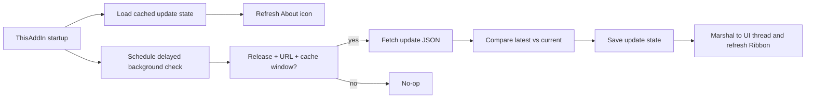

# Ribbon Version Reminder Design

日期：2026-05-19

状态：待评审

## 1. 背景与目标

OfficeAgent / Resy AI 当前在 Ribbon 的帮助组提供 `文档` / `Documentation` 和 `关于` / `About`。`关于` 已显示当前插件版本、程序集版本、构建配置和构建时间，但没有主动提醒用户新版本已经发布。

本设计新增一个轻量的新版本提醒能力：

- 当发布源存在比当前安装包更新的版本时，在 Ribbon `关于` / `About` 图标上显示红点。
- 点击 `关于` 后展示当前版本、最新版本、发布时间、更新说明和下载入口。
- 用户可以选择“忽略此版本”，红点消失；当后续出现更高版本时重新提醒。
- 更新检查只在 Release 安装包中启用，Debug / 本地开发刷新环境不请求更新源。
- 更新检查不能阻塞任何用户操作，不能影响 Excel 启动、Ribbon、任务窗格、登录、同步或模板工作流。

非目标：

- 不在第一版实现自动下载、自动安装、强制升级或后台安装。
- 不把更新检查 URL 暴露在普通任务窗格设置页。
- 不复用业务后端 `Business Base URL`，也不要求用户登录。
- 不因更新检查失败向用户弹窗。

## 2. 用户体验

### 2.1 Ribbon 入口

用户可见提醒只放在帮助组的 `关于` / `About` 按钮上。当前已确认不新增独立 `更新` 按钮，也不把红点放在 `xISDP AI` 主入口上，避免用户把它理解为 AI 消息或任务窗格状态。

状态规则：

- 无更新、检查失败、配置缺失、Debug 构建：`关于` 使用普通图标。
- 有新版本且用户未忽略该版本：`关于` 使用带红点图标。
- 用户忽略当前最新版本后：恢复普通图标。
- 下一次检查发现更高版本后：重新显示红点。

由于 Office 内置 `imageMso` 图标不能直接叠加红点，`关于` 按钮需要切换到自定义图片。第一版只替换 `aboutButton` 的图片来源，不改变按钮位置、标签、本地化或其他 Ribbon 控件布局。

### 2.2 关于对话框

点击 `关于` 仍然打开关于信息。新版本状态附加在现有版本信息之后：

- 当前版本。
- 最新版本。
- 发布时间，如果更新源提供。
- 更新标题或摘要，如果更新源提供。
- `下载` / `Download` 链接，如果更新源提供 `downloadUrl`。
- `发布说明` / `Release notes` 链接，如果更新源提供 `releaseNotesUrl`。
- `忽略此版本` / `Ignore this version` 操作，仅当存在未忽略的新版本时显示。

为了保留现有 WinForms / Office 原生交互风格，第一版可使用新的 WinForms 关于对话框替代当前简单 `MessageBox.Show`。如果更新源无可打开链接，按钮应禁用或隐藏，而不是显示不可用 URL。

## 3. 更新源合同

更新检查使用一个完整的独立 URL。该 URL 不依赖业务后端，不使用 `Business Base URL` 拼接，也不进入普通用户可编辑设置。

响应体是 JSON 字节流。即使响应头是 `Content-Type: application/octet-stream`，客户端也应读取响应 body 并按 UTF-8 JSON 解析，不能只依赖 content type。

第一版推荐 JSON 结构：

```json
{
  "latestVersion": "1.0.176",
  "downloadUrl": "https://example.internal/downloads/OfficeAgent-1.0.176.exe",
  "releaseNotesUrl": "https://example.internal/releases/1.0.176",
  "publishedAtUtc": "2026-05-19T08:00:00Z",
  "title": "OfficeAgent 1.0.176",
  "summary": "修复同步稳定性并改进登录状态刷新。"
}
```

字段规则：

- `latestVersion` 必填。缺失、为空或无法解析为版本号时，本次检查视为失败并只写日志。
- `downloadUrl` 可选。存在时必须是绝对 HTTP / HTTPS URL，否则忽略该字段。
- `releaseNotesUrl` 可选。存在时必须是绝对 HTTP / HTTPS URL，否则忽略该字段。
- `publishedAtUtc` 可选。无法解析时忽略。
- `title` 和 `summary` 可选。只用于关于对话框展示，不参与版本判断。

## 4. 配置模型

版本检查 URL 是内部配置，不进入任务窗格设置页。第一版支持以下来源，按优先级读取：

1. 安装包或部署环境写入的本机配置，例如注册表或应用配置文件。
2. 构建常量中的默认 URL。
3. 空值，表示禁用更新检查。

实现时应把读取逻辑封装在宿主层，例如 `UpdateCheckOptions` / `UpdateCheckConfiguration`，避免散落在 Ribbon 或 HTTP 客户端中。即使第一版只落地构建常量，也要保留未来由安装包写入配置的边界。

安全约束：

- URL 不包含用户 token、API key 或 SSO cookie。
- 请求不带业务 API key。
- 请求不带 SSO cookie。
- 不把更新响应原文写入普通 UI；诊断日志只记录必要的状态、版本号和错误摘要。

## 5. Release-only Gate

更新检查只在 Release 构建中启用。Debug 构建必须完全跳过检查请求。

推荐判断方式：

```csharp
#if DEBUG
    updateChecksEnabled = false;
#else
    updateChecksEnabled = true;
#endif
```

运行时仍可以叠加配置开关：如果 Release 构建但 URL 为空，则禁用检查。这样本地 `eng/Dev-RefreshExcelAddIn.ps1`、Debug VSTO add-in 和测试环境不会打更新接口。

## 6. 非阻塞执行

更新检查必须是 best-effort 后台行为：

- `ThisAddIn_Startup` 不等待更新检查完成。
- Ribbon 初始化、任务窗格初始化、登录、项目加载、同步、模板操作都不依赖更新检查结果。
- 启动后可延迟数秒再检查，减少与 Excel / WebView2 / Ribbon 初始化抢资源。
- HTTP 请求应有短超时，例如 5 秒。
- 任何异常都被捕获并写 `OfficeAgentLog.Warn` 或 `OfficeAgentLog.Error`。
- 失败不弹窗、不禁用按钮、不改变任务窗格状态。

推荐数据流：



## 7. 缓存与忽略状态

状态文件保存在：

```text
%LocalAppData%\OfficeAgent\update-state.json
```

推荐结构：

```json
{
  "lastCheckedAtUtc": "2026-05-19T08:00:00Z",
  "latestVersion": "1.0.176",
  "downloadUrl": "https://example.internal/downloads/OfficeAgent-1.0.176.exe",
  "releaseNotesUrl": "https://example.internal/releases/1.0.176",
  "publishedAtUtc": "2026-05-19T08:00:00Z",
  "title": "OfficeAgent 1.0.176",
  "summary": "修复同步稳定性并改进登录状态刷新。",
  "ignoredVersion": "1.0.176"
}
```

缓存规则：

- 24 小时内不重复请求更新源。
- 如果缓存中已有比当前版本更新、且未被忽略的版本，启动后可以立即显示红点。
- 如果版本检查成功，更新 `lastCheckedAtUtc` 和 latest 信息。
- 如果版本检查失败，不清空已有 latest 信息；但本次失败不应制造新红点。
- 用户点击“忽略此版本”后写入 `ignoredVersion = latestVersion` 并刷新 Ribbon。
- 如果未来检查到的 `latestVersion` 高于 `ignoredVersion`，红点重新出现。

状态文件损坏时：

- 视为无缓存。
- 写诊断日志。
- 不向用户弹窗。

## 8. 版本比较

当前安装版本来自 `VersionInfo.AppVersion`。更新源的 `latestVersion` 使用同一语义版本格式。

比较规则：

- 支持 `major.minor.patch` 或当前项目已使用的 `major.minor.build`，例如 `1.0.175`。
- 可容忍前缀 `v`，例如 `v1.0.176`。
- 仅当 `latestVersion > currentVersion` 时认为有新版本。
- 相等或更低版本不显示红点。
- 无法解析的版本号视为检查失败，只写日志。

## 9. 组件设计

建议新增宿主层更新模块，避免把 HTTP、缓存和 Ribbon UI 混在 `AgentRibbon` 里。

### 9.1 ExcelAddIn

新增：

- `Updates/UpdateCheckOptions.cs`
- `Updates/UpdateManifest.cs`
- `Updates/UpdateCheckResult.cs`
- `Updates/IUpdateManifestClient.cs`
- `Updates/UpdateManifestClient.cs`
- `Updates/IUpdateStateStore.cs`
- `Updates/FileUpdateStateStore.cs`
- `Updates/UpdateNotificationService.cs`

职责：

- `UpdateManifestClient`：GET 独立 URL，读取 body，按 JSON 解析；忽略不准确 content type。
- `FileUpdateStateStore`：读写 `%LocalAppData%\OfficeAgent\update-state.json`。
- `UpdateNotificationService`：组合 Release gate、缓存窗口、版本比较、忽略状态和后台检查。
- `ThisAddIn`：创建服务，启动时加载缓存并调度后台检查。
- `AgentRibbon`：只订阅状态变化，刷新 `aboutButton` 图标，并打开关于对话框。

### 9.2 Ribbon 图标

第一版只为 `aboutButton` 引入自定义图片：

- 普通关于图标。
- 带红点关于图标。

图片可放入 `Properties/Resources.resx`，或由代码基于现有资源动态生成。为了测试和维护清晰，推荐使用资源属性，例如：

- `RibbonAbout`
- `RibbonAboutWithUpdate`

设置图标时清空 `aboutButton.OfficeImageId`，保留 `ShowImage = true` 和 `RibbonControlSizeLarge`。

## 10. 本地化

新增中文和英文文案：

- 有新版本标题。
- 当前版本。
- 最新版本。
- 发布时间。
- 更新说明。
- 下载。
- 发布说明。
- 忽略此版本。
- 已是最新版本。
- 更新信息暂不可用。

文案仍由 `HostLocalizedStrings` 根据 Excel UI 语言或 `uiLanguageOverride` 解析。更新检查本身不依赖语言。

## 11. 日志与诊断

日志分类建议使用 `updates`。

记录：

- 更新检查被跳过：Debug、URL 为空、缓存未过期。
- 更新检查开始和成功。
- 发现新版本。
- 当前已是最新版本。
- 用户忽略版本。
- 请求失败、JSON 解析失败、版本解析失败、状态文件读写失败。

不记录：

- 完整 JSON 响应。
- 下载 URL 中的敏感 query 参数。如果 URL 可能包含敏感参数，日志只记录 host 和 path 或只记录字段存在性。

## 12. 测试策略

Infrastructure / update module:

- octet-stream 响应体仍按 JSON 解析。
- 非 2xx、超时、非法 JSON、缺少 `latestVersion` 都返回失败或抛出受控异常，由 service 捕获。
- `v1.0.176`、`1.0.176` 版本比较正确。
- 当前版本相等或更低时不产生提醒。
- `latestVersion` 高于当前版本且未忽略时产生提醒。
- `ignoredVersion == latestVersion` 时不提醒。
- `latestVersion > ignoredVersion` 时重新提醒。
- 24 小时缓存窗口内不发 HTTP 请求。
- 状态文件损坏时不抛到调用方。

ExcelAddIn:

- Debug 构建路径不会创建或执行更新 HTTP 请求。
- `ThisAddIn_Startup` 不等待更新检查任务。
- Ribbon 配置中 `aboutButton` 保持大按钮布局和本地化标签。
- 更新状态变化会刷新 `aboutButton` 图片。
- 点击忽略后调用状态服务并刷新 Ribbon。

Manual:

- Release 构建配置有效更新 URL，mock 返回更高版本，打开 Excel 后 `关于` 出现红点。
- 点击 `关于` 可看到当前版本和最新版本。
- 点击下载 / 发布说明可打开默认浏览器。
- 点击忽略后红点消失。
- 把 mock 版本号提高到更高版本后，红点重新出现。
- 断网或 mock 返回非法 JSON 时 Excel 正常启动，Ribbon、任务窗格、同步操作可正常使用。

## 13. 文档维护

实现时同步更新：

- `docs/modules/ribbon-sync-current-behavior.md`
  - 帮助组 `关于` 支持 Release-only 新版本红点提醒和忽略版本。
- `docs/vsto-manual-test-checklist.md`
  - 增加更新检查手工验证项。
- `docs/ribbon-button-custom-icons-guide.md`
  - 如果 `aboutButton` 正式切换为自定义资源，应记录该例外和测试重点。
- 如安装包负责写入更新 URL，同步更新 installer 相关文档或 build 脚本说明。

## 14. 验收标准

- Debug / dev refresh 环境不会请求更新 URL。
- Release 构建在 URL 有效且缓存过期时后台检查更新，且不阻塞任何用户操作。
- `Content-Type: application/octet-stream` 的 JSON 字节流可以被正确解析。
- 新版本高于当前版本时，`关于` 图标显示红点。
- 点击 `关于` 能看到当前版本、最新版本和可用链接。
- 用户忽略当前最新版本后红点消失，并持久化到下次启动。
- 后续更高版本发布后红点重新出现。
- 更新检查失败只写日志，不弹窗，不影响 Ribbon、任务窗格、登录、同步或模板操作。
